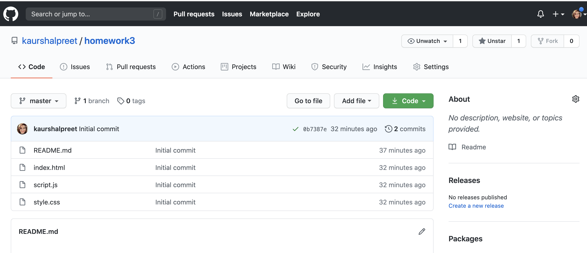
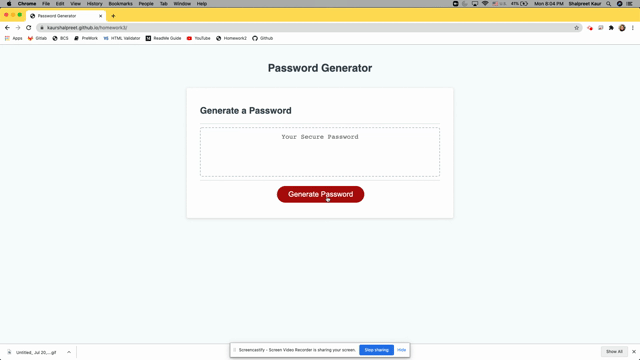
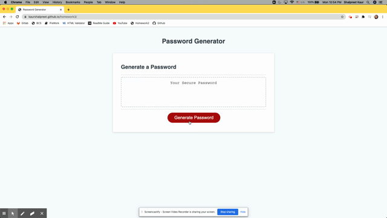

# Password Generator
## Description
 This is a random password generator using JavaScript code. 
 [The project can be accessed at my github repository](https://github.com/kaurshalpreet/homework3)

 

---

## Running the Application

[The Password Generator page can be accessed via github page here](https://kaurshalpreet.github.io/homework3/)

This is a random password generator application. This appliaction will run in the browser and feature dynamically updated HTML and CSS powered by JavaScript code. 

On clicking the "Generate Password" button on the page, The application will prompt the user to enter the length of the password. Once the password length has been entered the application will check if the length is greater than 8 and less than 128. If the length is not within the specified range then the application throws an error for the same. 

---

If the length entered is within the range, then the user is prompted to specify which of the following needs to be included in the password.
* Lower case
* Upper case
* Number between 0 - 9
* Special Character

Once the selections are done by the user, the application then generates a random password based on the inputs from the user and displays on the page.

---

If the user select none of the above four combinations, then it throws an alert to select at least one combination.

---

## Credits
* UC Davis BootCamp-Instructor & TAs!
* https://www.google.com/
* https://www.youtube.com/

 
